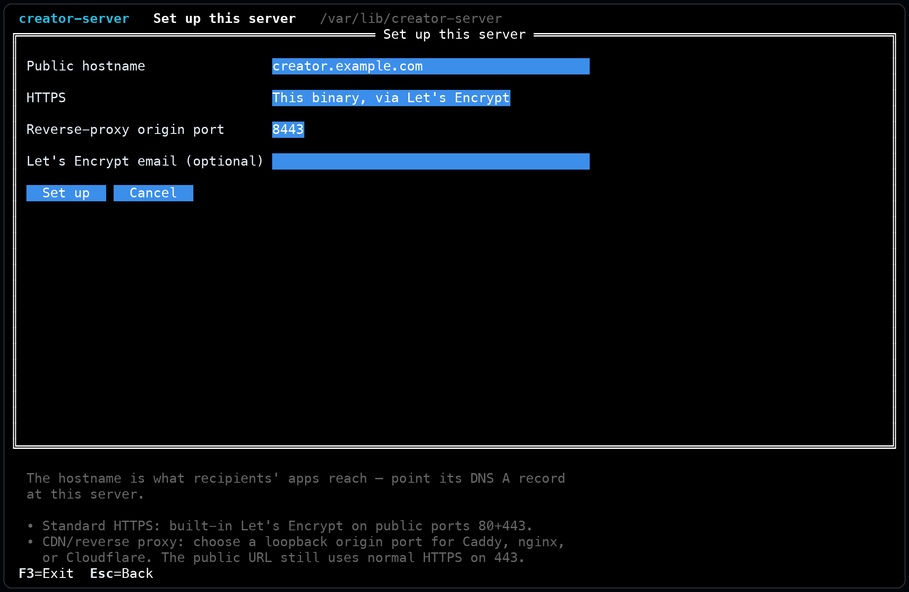
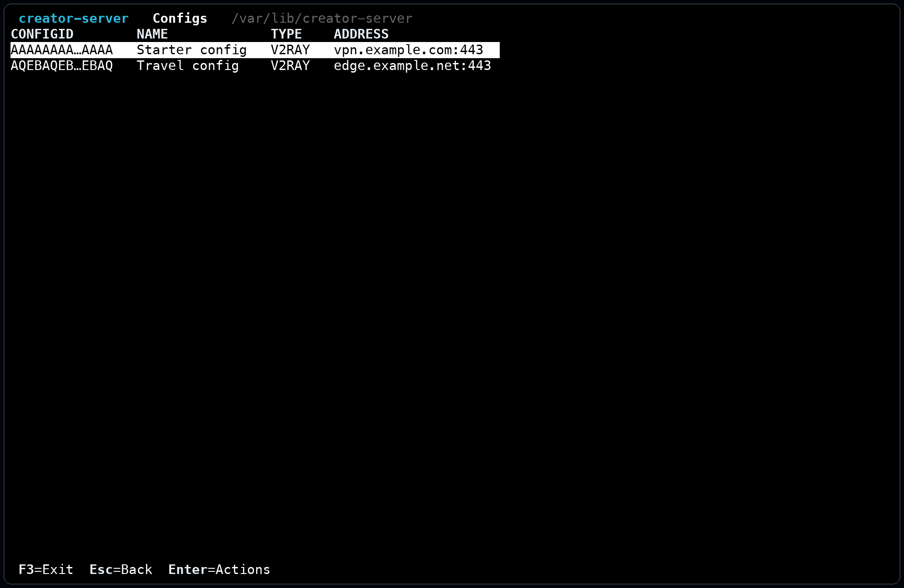
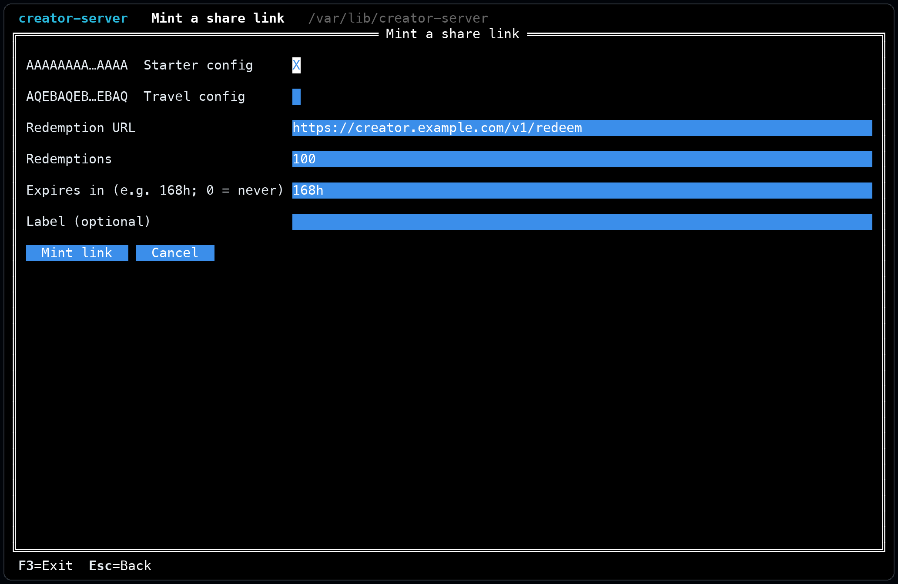
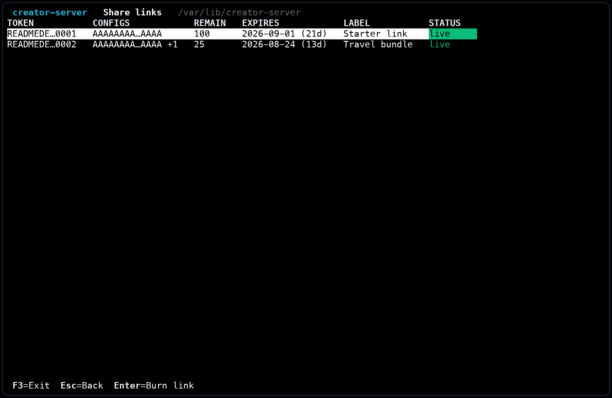

# creator-server

A self-hosted distribution server for NpvTunnel creators. It stores the VPN
configs a creator chooses to share, enforces their restrictions, and hands them
to recipient devices through signed, redeemable links. It runs beside the
creator's VPN servers; it does not run or control them.

The creator experience is intentionally dashboard-only. Installation starts the
first-run setup menu, and every later task lives in the same terminal dashboard.
Creators do not need to learn management commands or edit state files.

## Install

On a Linux server, run:

```sh
curl -fsSL https://raw.githubusercontent.com/mukswilly/npvtunnel-creator-server/main/install.sh | sh
```

The installer selects the correct signed release for `amd64` or `arm64`, checks
its SHA-256 digest, verifies its Sigstore signature when `cosign` is available,
creates an isolated `creator` account and state directory, and opens guided
setup. Setup asks for the creator's domain and either configures built-in HTTPS
or prepares a loopback origin for an existing CDN or reverse proxy.

After installation, the only creator-facing entry point is:

```sh
npv-creator
```

That launcher opens the dashboard under the isolated account. The API process,
service manager, file ownership, and privileged service controls remain behind
the dashboard.

## Dashboard workflow

### Set up the server

Choose the public hostname and HTTPS arrangement. Built-in HTTPS obtains and
renews a Let's Encrypt certificate on ports 80 and 443. Reverse-proxy mode binds
the API to loopback on a selectable origin port so Caddy, nginx, or a CDN can
provide public HTTPS.

Cloudflare orange-cloud DNS cannot reach the loopback listener by itself. Use a
local HTTPS reverse proxy or Cloudflare Tunnel as described in
[the Cloudflare deployment guide](docs/cloudflare.md). The Server screen checks
the loopback origin and public edge separately so origin-only success is not
mistaken for a working recipient path.

<p align="center">
  <a href="docs/images/setup.png"></a>
</p>

### Import configs

Prepare a V2Ray or SSH config and its restrictions in the app, copy its server
registration, and paste that registration into the dashboard. The server does
not provide a config editor and does not accept raw config JSON; the app remains
the source of every registered config.

The dashboard assigns the config its routing identity. A running server notices
additions, replacements, and removals without a restart.

<p align="center">
  <a href="docs/images/configs.png"></a><br>
  <sub>Review imported configs before sharing</sub>
</p>

### Create share links

Select one or several configs, choose the redemption budget and optional
expiry, and mint one `npvtunnel://join` link. A recipient opening it receives
fresh envelopes sealed to that device. The config itself is never embedded in
the public link.

<table>
  <tr>
    <td width="50%"><a href="docs/images/mint-link.png"></a></td>
    <td width="50%"><a href="docs/images/share-link.png"></a></td>
  </tr>
  <tr>
    <td align="center"><sub>Select configs, limits, and expiry</sub></td>
    <td align="center"><sub>Monitor remaining uses or burn a link</sub></td>
  </tr>
</table>

The **Share links** screen shows remaining redemptions, expiry and status. Burn
a link there to stop future redemptions. Configs already issued through it keep
working until their next refresh or policy expiry.

### Direct handouts

When a creator already has a recipient's device public key, **Direct handout**
creates a `.npvs` pointer specifically for that device. The result is written to
the protected state directory and can also be copied from the dashboard.

### Operate and protect the service

The **Server** screen contains health, certificate status, creator identity,
logs, start/stop/restart controls, setup changes and binary updates. **Back up
state** writes the signing identity, configs and links to one protected archive.
Store that archive off the server: the signing key is the creator's identity,
and losing it breaks trust for existing recipients.

## How recipient delivery works

Two HTTPS endpoints carry recipient traffic:

- **`POST /v1/redeem`** exchanges a share-link token and recipient public key
  for one or more freshly minted `.npvs` discovery envelopes. Each envelope is
  encrypted for that recipient and signed by the creator.
- **`POST /v1/issue`** accepts a request signed by the recipient device, applies
  the selected config's rate limit and attestation policy, and returns the
  current config with a creator-signed receipt.

The discovery envelope contains the creator's API pointer and public key, not
the VPN config. Recipients pin the creator identity and fetch the current config
when they connect, allowing the creator to rotate or replace a config without
publishing another link.

## Attestation and rate limits

Attestation is selected per config in NpvTunnel and is off by default. Strict
policies use Android Key Attestation with verified boot and Apple App Attest
with the expected app identity. Registrations without an iOS app identity
cannot satisfy strict attestation on iOS.

Issuance rate limits are always active per device and config. Redemption is
also rate-limited per client IP, and the server caps concurrent requests. These
controls limit automated draining while preserving ordinary recipient traffic.

## State and security

The installer creates `/var/lib/creator-server` with owner-only access. It
contains:

| File | Purpose |
|---|---|
| `creator-key.pem` | The P-256 signing identity pinned by recipients. |
| `audit-salt.bin` | Salt used to hash device identifiers in audit records. |
| `configs.json` | Registered configs and their policies. |
| `redemption-tokens.json` | Live share links and their remaining budgets. |
| `console.json` | Dashboard deployment preferences. |

Audit records contain no raw device keys, tokens or client IPs. Device keys are
represented by salted hashes. Public deployments should expose only SSH and
HTTP(S) through their firewall and use a network edge capable of absorbing
volumetric attacks.

## HTTP API

| Endpoint | Purpose |
|---|---|
| `POST /v1/issue` | Return the current registered config after policy and signature checks. |
| `POST /v1/redeem` | Redeem a share link into per-recipient discovery envelopes. |
| `GET /v1/creator-pubkey` | Return the creator's public signing key. |
| `GET /healthz` | Liveness probe. |

The request and response shapes are defined in [types.go](types.go). The
handlers are in [server.go](server.go) and [redeem.go](redeem.go), and the
`.npvs` envelope format is implemented in [envelope.go](envelope.go).

## License

[Apache-2.0](LICENSE) — see also [NOTICE](NOTICE).
